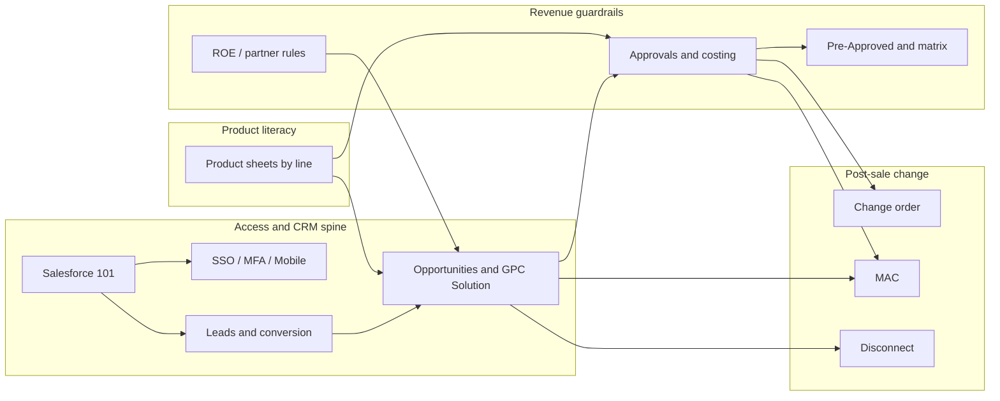

# GPC Training Corpus — Content Bible

**Companion (full text):** The **canonical compilation of all extractable PDF text** (737 pages, every document) lives in [`gpc-training-corpus-canonical-text.md`](gpc-training-corpus-canonical-text.md). Regenerate it with `python3 scripts/extract_gpc_corpus_to_markdown.py -o docs/gpc-training-corpus-canonical-text.md` after PDF updates. Use that file when tightening module front matter or building RAG chunks; use *this* file for inventory, module mapping, teaching order, and deduplication.

**Structured extract (tables + body):** [`gpc-training-corpus-structured.md`](gpc-training-corpus-structured.md) — PyMuPDF `find_tables()` + `to_markdown()`, with non-table text as spatial blocks. Regenerate: `python3 scripts/extract_gpc_corpus_structured.py -o docs/gpc-training-corpus-structured.md`.

**OCR validation:** [`gpc-training-corpus-ocr-validation.md`](gpc-training-corpus-ocr-validation.md) compares flat extract vs EasyOCR on PNGs (sampled pages) — `python3 scripts/validate_gpc_extract_vs_ocr.py` (see `scripts/requirements-ocr-validation.txt`).

**Purpose:** Structured reference for what exists in the desktop training corpus, how topics connect, and how they align with **Sales-Navigator** modules.

**Evidence convention:** Paths are under the user’s machine unless noted. Raster output:  
`/Users/ba/Desktop/GPC Training Material - page images/<relative>/page-NNN.png`  
Source PDF (mirrored):  
`/Users/ba/Desktop/GPC Training Material/<relative>.pdf`  
(Each `dir/Name.pdf` → `…/dir/Name/page-001.png` per `scripts/rasterize_pdf_tree.py`, default **200 DPI**.)

**Last full raster run (reported):** 135 PDFs → 737 page PNGs (all succeeded).

---

## Table of contents

1. [How this bible stays current](#1-how-this-bible-stays-current)
2. [Corpus statistics](#2-corpus-statistics)
3. [Alignment with Sales-Navigator](#3-alignment-with-sales-navigator)
4. [Topic clusters & module inventory](#4-topic-clusters--module-inventory)
5. [Teaching order & dependency graph](#5-teaching-order--dependency-graph)
6. [Topic glossary (abbreviated)](#6-topic-glossary-abbreviated)
7. [Duplicates & overlaps](#7-duplicates--overlaps)
8. [Gaps & open questions](#8-gaps--open-questions)
9. [Appendix: full raster inventory](#appendix-full-raster-inventory)

---

## 1. How this bible stays current

| Action | Command / location |
|--------|-------------------|
| Re-raster after PDF changes | `python3 scripts/rasterize_pdf_tree.py` (see `--src`, `--dst`, `--dpi` in script) |
| Dependencies | `pymupdf` in `scripts/requirements.txt` |
| Module copy & SharePoint links | `modules/*/content.md`, `docs/sales-navigator-all-modules.md` |
| Authoring rules | `.cursor/rules/module-content-enrichment.mdc`, `.cursor/rules/module-section-roles.mdc` |

Re-run a folder inventory (page counts per PDF folder):

```bash
python3 - <<'PY'
from pathlib import Path
root = Path("/Users/ba/Desktop/GPC Training Material - page images")
for d in sorted(root.rglob("*")):
    if d.is_dir() and list(d.glob("page-*.png")):
        n = len(list(d.glob("page-*.png")))
        print(n, d.relative_to(root))
PY
```

---

## 2. Corpus statistics

| Metric | Value |
|--------|------|
| PDF folders with ≥1 PNG | **135** |
| Total `page-*.png` files | **737** |
| Top-level folders under page images (approx.) | Mixed: many assets live under `extracted/`, `Product Training/`, and loose battlecard roots |
| Largest single assets (page count) | `Product Training/Internal ONLY - Ascend Sales Kick Off_Master (1)` **125**; `Product Training/Internal ONLY - Setting For Success - Customizing Your Demo Eoin & Mitch` **55**; `extracted/.../Move-Add-Change Processes - Sales Team - 1123` **26**; `Product Training/Product Training - GPC Cloud Connect` **26**; `Salesforce 101 Manual - 0422` **17** |

---

## 3. Alignment with Sales-Navigator

`sales-navigator/modules-manifest.json` defines app modules (order, category). Map corpus **topics** to **`module id`** for consistent naming in handouts, RAG metadata, and future `reference_files` labels.

| `module` `id` | Category | Primary corpus touchpoints |
|-----------------|----------|----------------------------|
| `getting-started` | Welcome | App tour (non-PDF); optional pointer to SF 101 |
| `sales-rules-of-engagement` | Sales | ROE PDF; partner/referral guides with “rules” tone |
| `sales-process-and-salesforce` | Sales | SF 101, leads/opps, DocuSign, dashboards, parent opportunity, forecasting |
| `sales-operations-and-approvals` | Sales | Approvals overview, matrix, Pre-Approved, costing routing, change order, MAC, disconnect, NISC/iVUE (ops lens) |
| `portfolio-and-business-capabilities` | Product | Business capability deck; cross-product / NMP-style sheets |
| `product-connectivity` | Product | DIA/SIA/Ethernet/fiber/off-net/cloud connect collateral |
| `product-security-and-sd-wan` | Product | SD-WAN, managed security, DDoS |
| `product-cloud-wifi-and-backup` | Product | Managed Wi‑Fi, wireless backup / 5G |
| `product-itv` | Product | iTV product sheet |
| `product-uc-voice-and-collaboration` | Product | UC, Teams, contact center, voice |
| `competitive-positioning` | Sales | Battlecards, “vs” one-sheets |
| `account-based-marketing` | Sales | *No dedicated folder observed in this raster tree* |
| `operational-business-reviews` | Sales | OBR SOP, readiness form, customer move (adjacent) |
| `map-book` | Map Book | *No dedicated training PDF in this tree* |

---

## 4. Topic clusters & module inventory

### 4.1 Salesforce & revenue operations (`extracted/OneDrive_1_4-10-2026 (3)/`)

Canonical **Sales / Ops** quick references and manuals. Strong match to **`sales-process-and-salesforce`** and **`sales-operations-and-approvals`**.

| Pages | Folder (under `…/page images/`) | Primary `module_id` | Audience | Prerequisite notes |
|------|-----------------------------------|---------------------|----------|---------------------|
| 12 | `extracted/OneDrive_1_4-10-2026 (3)/Approval Overview and Training Guide - 0725` | sales-operations-and-approvals | AE, Sales Mgmt | Deal basics; when approvals apply |
| 1 | `extracted/OneDrive_1_4-10-2026 (3)/Approval Requirements Matrix v5.5 - 0725` | sales-operations-and-approvals | All sales | Pair with Approval Overview |
| 2 | `extracted/OneDrive_1_4-10-2026 (3)/Assigning Leads Quick Reference Guide - 1123` | sales-process-and-salesforce | AE, SDR | Lead ownership model |
| 4 | `extracted/OneDrive_1_4-10-2026 (3)/Change Order Process - Sales Team - 0325` | sales-operations-and-approvals | AE | Booked/not Billed; vs MAC |
| 2 | `extracted/OneDrive_1_4-10-2026 (3)/Contact Roles Quick Reference Guide - 1023` | sales-process-and-salesforce | AE | Accounts/contacts |
| 2 | `extracted/OneDrive_1_4-10-2026 (3)/Converted Lead Info Button Quick Reference Guide - 1123` | sales-process-and-salesforce | AE | Post-conversion navigation |
| 3 | `extracted/OneDrive_1_4-10-2026 (3)/Converting Leads to an Opportunity Quick Reference Guide - 1123` | sales-process-and-salesforce | AE | Qualification |
| 5 | `extracted/OneDrive_1_4-10-2026 (3)/Costing Routing Quick Reference Guide - 1123` | sales-operations-and-approvals | AE | After approval concepts |
| 4 | `extracted/OneDrive_1_4-10-2026 (3)/Create a Custom List View Quick Reference Guide - 0922` | sales-process-and-salesforce | All sales | SF navigation |
| 2 | `extracted/OneDrive_1_4-10-2026 (3)/Dark Fiber Quick Reference Guide - 0724` | sales-operations-and-approvals | AE, Mgmt | Matrix / elevated approval |
| 1 | `extracted/OneDrive_1_4-10-2026 (3)/Dashboard Pal Quick Reference Guide-0822` | sales-process-and-salesforce | AE | Dashboards |
| 5 | `extracted/OneDrive_1_4-10-2026 (3)/Dashboards Quick Reference Guide - Sales - 0224` | sales-process-and-salesforce | AE, Mgmt | Pipeline hygiene |
| 4 | `extracted/OneDrive_1_4-10-2026 (3)/Disconnection Process - Sales Team - 1022` | sales-operations-and-approvals | AE | Post-billing full removal |
| 4 | `extracted/OneDrive_1_4-10-2026 (3)/Forecasting Quick Reference Job Aid - 0622` | sales-process-and-salesforce | Mgmt, AE | Stages / forecast |
| 26 | `extracted/OneDrive_1_4-10-2026 (3)/Move-Add-Change Processes - Sales Team - 1123` | sales-operations-and-approvals | AE | Billed baseline; vs change order |
| 1 | `extracted/OneDrive_1_4-10-2026 (3)/Off-Net Quick Reference Guide - 0723` | product-connectivity *(or SF if field-meaning-only)* | AE | On/off-net literacy |
| 1 | `extracted/OneDrive_1_4-10-2026 (3)/Parent Opportunity Financial Calculations Quick Reference Guide - 1023` | sales-process-and-salesforce | AE | Parent/zone rollup |
| 1 | `extracted/OneDrive_1_4-10-2026 (3)/Parent Opportunity Process Training Guide - 0822` | sales-process-and-salesforce | AE, Mgmt | Parent opp model |
| 5 | `extracted/OneDrive_1_4-10-2026 (3)/Partner Referral Program Quick Reference Guide - Enterprise Sales Only - 1223` | sales-rules-of-engagement | Enterprise AE | Eligibility / motion |
| 2 | `extracted/OneDrive_1_4-10-2026 (3)/Pre-Approved Order Process Quick Reference Guide - 0723` | sales-operations-and-approvals | AE | With matrix + overview |
| 4 | `extracted/OneDrive_1_4-10-2026 (3)/Product Quick Reference Guide - DIA - 0224` | product-connectivity | AE | Product meaning |
| 14 | `extracted/OneDrive_1_4-10-2026 (3)/Salesforce & DocuSign Integration Training Guide - 0623` | sales-process-and-salesforce | AE, Admin (config) | GPC Solution, signers |
| 17 | `extracted/OneDrive_1_4-10-2026 (3)/Salesforce 101 Manual - 0422` | sales-process-and-salesforce | All sales | Onboarding spine |
| 5 | `extracted/OneDrive_1_4-10-2026 (3)/Salesforce Add-in for Outlook Quick Reference Guide - 1123` | sales-process-and-salesforce | All sales | Outlook |
| 2 | `extracted/OneDrive_1_4-10-2026 (3)/Salesforce Comments Quick Reference Guide - 0723` | sales-process-and-salesforce | All sales | Chatter/comments |
| 10 | `extracted/OneDrive_1_4-10-2026 (3)/Salesforce Mobile Application MFA & SSO Login Quick Reference Job Aid - 0522` | sales-process-and-salesforce | All sales | MFA |
| 3 | `extracted/OneDrive_1_4-10-2026 (3)/Salesforce SSO & MFA Quick Reference Guide - 0422` | sales-process-and-salesforce | All sales | SSO |
| 9 | `extracted/OneDrive_1_4-10-2026 (3)/Salesforce-NISC-iVUE Integration Overview 0222` | sales-operations-and-approvals *(or SF if seller-only)* | AE vertical, Admin | Order lifecycle split SF vs NISC |

**Suggested teaching block (this cluster only):** Access/UI (101 → MFA/SSO → mobile → Outlook → lists/dashboards) → core motion (leads → conversion → contact roles → parent opps/finance) → DocuSign → approvals (Overview → Matrix → Pre-Approved → costing) → post-sale path (Change order vs MAC vs disconnect) → optional product tie-ins (DIA, off-net).

---

### 4.2 Product one-pagers & collateral (`extracted/OneDrive_1_4-10-2026 (1)/`)

Structured by product line folders (Cloud Connect, DDoS, Ethernet, Fiber, Internet/DIA-SIA, Managed Firewall, Managed Wi‑Fi, NMP, etc.). **Naming rules** for classification:

- `*sheet*`, `*datasheet*` → **Product sheet**
- `*vs*`, `*comparison*` → **Plan / technology comparison** (often `competitive-positioning` if vs competitor)
- `*battlecard*`, `*one sheet*` → **Battlecard** → usually `competitive-positioning`
- `*terms*`, reporting definitions → treat as **internal / enablement** flavor

Representative mapping (evidence: same paths in appendix):

| Product line | Example path fragment | `module_id` |
|--------------|----------------------|-------------|
| Cloud Connect | `…(1)/Cloud Connect/Cloud Connect 011725` | product-connectivity |
| DDoS | `…(1)/DDoS/…` | product-security-and-sd-wan |
| Ethernet | `…(1)/Ethernet/…` | product-connectivity |
| Fiber | `…(1)/Fiber Delivery/…` | product-connectivity / competitive-positioning |
| DIA/SIA | `…(1)/Internet/…` | product-connectivity |
| Managed firewall / MNS | `…(1)/Managed Firewall & Security/…` | product-security-and-sd-wan |
| Managed Wi‑Fi | `…(1)/Managed Wi-Fi/…` | product-cloud-wifi-and-backup |
| iTV | `…(1)/GPC iTV for Business/…` | product-itv |
| NMP | `…(1)/Network Monitoring Portal/…` | portfolio-and-business-capabilities *(or connectivity if org standard ties it)* |

**SD-WAN & UC** also exist under `(1)` in the full tree (briefs, use cases, UC plans, Teams) — map SD-WAN → `product-security-and-sd-wan`, UC/voice → `product-uc-voice-and-collaboration`.

---

### 4.3 Programs, OBR, spiffs (`extracted/OneDrive_1_4-10-2026 (2)/`)

| Pages | Folder | `module_id` | Notes |
|------|--------|-------------|--------|
| 1 | `…(2)/Approval Requirements Matrix v5.5 - 0725` | sales-operations-and-approvals | **Duplicate** of `(3)` copy — see §7 |
| 5 | `…(2)/Operational Business Review - OBR/OBR Sales Readiness Form - Fillable` | operational-business-reviews | |
| 6 | `…(2)/Operational Business Review - OBR/OBR SOP v1.2` | operational-business-reviews | |
| 4 | `…(2)/Customer Move Process.Procedure` | operational-business-reviews / sales-operations | Customer success motion |
| 6 | `…(2)/Temporary Bandwidth Upgrade P.P` | product-connectivity | |
| … | Spiffs, APNI, building entry flyer | sales / ops | Label by program owner |

---

### 4.4 Pricing & internal pricebooks (`extracted/OneDrive_1_4-10-2026 (4)/`)

**Sensitive / INTERNAL** naming: fee schedules, `*_INTERNAL*`, iTV **Old Pricing**, UC pricing in SF, market-group PDFs. Audience: **pricing-approved roles**, not general field RAG without policy gate.

Map by folder: `DIA & SIA`, `Ethernet`, `SD-WAN`, `Voice`, `WiFi`, `Wave`, `GPC iTV`, `Managed Network Security`, `Unified Communications`, `Wireless Backup & Broadband`, `Business Security`, `Multi-Service Discount`.

---

### 4.5 Root-level & `Product Training/` (mixed)

| Location | Role |
|----------|------|
| `Business Capability Presentation` | Portfolio narrative |
| `*Battle Card*` at root (SD-WAN, Ethernet, Managed Wi‑Fi, 5G, Cox, Omaha Metro, UC competitor, Fiber vs Starlink) | Competitive / product positioning |
| `Driver Training PDF 2025 1 (1)` | Non-sales compliance (fleet/safety) — **separate curriculum track** |
| `Sales Rules of Engagement (ROE) - Revised August 2025 (1)` | **1 page** — likely excerpt; see §8 |
| `Product Training/*` | Deep slides: **Internal ONLY** SKO, Configure, UC IPN, DDoS training, CNMP wholesale, etc. |

---

## 5. Teaching order & dependency graph

High-level **recommended prerequisite flow** (not every PDF is required for every role):



**Role shortcuts**

- **New AE:** SF 101 → MFA → leads/conversion → GPC Solution → DocuSign → approvals cluster → change vs MAC.
- **Solution architect–heavy:** Product sheets `(1)` + pricing `(4)` **after** approvals literacy (know what escalates).
- **Managers:** Dashboards + forecasting + OBR SOP + approval matrix interpretation.

---

## 6. Topic glossary (abbreviated)

| Term | Meaning in this corpus |
|------|------------------------|
| **GPC Solution** | Salesforce object / workflow hub for quotes, sites, services, approvals |
| **Parent / Zone opportunity** | Roll-up opportunity; financial and approval context |
| **Pre-Approved** | Fiber fast-path skipping standard approvals when criteria met |
| **MAC** | Move / Add / Change after **billing** started (partial contract change) |
| **Change order** | Partial change **before** billing (Conga change order pack) |
| **Cancellation / Disconnect** | Remove **all** services pre- vs post-billing |
| **CRC / BCC** | Business care paths for narrow adds/changes (email **businesscare@gpcom.com** per MAC guide) |
| **PMO / CRC (ops)** | Project and billing coordination post change order |
| **DIA / SIA** | Dedicated / shared internet access products |
| **NISC / iVUE** | Back-office integration; seller-visible vs admin scope |
| **OBR** | Operational business review cadence |

---

## 7. Duplicates & overlaps

| Finding | Evidence (page images path) |
|--------|-----------------------------|
| **Fiber vs Starlink** same 8 pages | `Fiber vs Starlink Battlecard` **and** `extracted/OneDrive_1_4-10-2026 (1)/Fiber Delivery/Fiber vs Starlink Battlecard` |
| **5G wireless launch** same 19 pages | `Product Training/GPC Wireless Internet 5G Product Launch` **and** `extracted/OneDrive_1_4-10-2026/Wireless Internet Backup/GPC Wireless Internet 5G Product Launch` |
| **Approval matrix** 1-pager twice | `extracted/OneDrive_1_4-10-2026 (2)/Approval Requirements Matrix v5.5 - 0725` **and** `extracted/OneDrive_1_4-10-2026 (3)/…` |
| **SD-WAN or Network Security Fee Schedule** duplicated | `…(4)/Managed Network Security/SD-WAN or Network Security Fee Schedule` **and** `…(4)/SD-WAN/SD-WAN or Network Security Fee Schedule` |
| **Related but not dupes** | Root battlecards vs `(1)` product sheets (e.g. SD-WAN battle card vs SD-WAN brief) — **complementary** |

**Recommendation:** Pick a **canonical copy** per duplicate set for RAG indexing; keep others as `alias_of` metadata or exclude from retrieval to avoid double chunks.

---

## 8. Gaps & open questions

### Gaps (not observed in this raster tree)

- **Full multi-page ROE** — only `Sales Rules of Engagement (ROE) - Revised August 2025 (1)` with **1** PNG folder; may be excerpt or wrong extract. *Evidence:* `…/Sales Rules of Engagement (ROE) - Revised August 2025 (1)/page-001.png`.
- **ABM module** — no obvious ABM PDF folder name.
- **E-Rate / USAC standalone** — not present as dedicated doc (may live only inside ROE / compliance elsewhere).
- **Executive Map Book** — no dedicated training PDF in tree (may be separate asset).

### Open questions

1. **ROE:** Confirm whether a **full** ROE PDF should be rasterized and replace the 1-page folder, or if the app’s canonical ROE is SharePoint-only (`reference_files` in `sales-rules-of-engagement`).
2. **OneDrive roots `(1)–(4)`:** Are these overlapping exports? Should dedup be **policy** (keep `(3)` for SF ops, `(1)` for product sheets, etc.)?
3. **125-page Ascend SKO:** Confirm **internal-only** distribution and whether to **exclude** from customer-facing or general RAG corpora.
4. **Approval matrix 1 page:** Matrix is multi-page in production training; verify raster source PDF wasn’t a **single-page export** — compare to `page images/…/Approval Requirements Matrix v5.5 - 0725/page-001.png` vs full PDF page count in Finder.

---

## Appendix: Full raster inventory

Sorted by relative path. **Pages** = count of `page-*.png` in folder.

| Pages | Relative path |
|------:|---------------|
| 1 | Battlecard - 5G Wireless Backup |
| 5 | Business Capability Presentation |
| 1 | Cox Acquisition Battle Card v2 |
| 19 | Driver Training PDF 2025 1 (1) |
| 2 | Ethernet Battle Card FINAL |
| 1 | extracted/OneDrive_1_4-10-2026 (1)/Cloud Connect/Cloud Connect 011725 |
| 2 | extracted/OneDrive_1_4-10-2026 (1)/DDoS/DDoS Product Sheet 012025 |
| 3 | extracted/OneDrive_1_4-10-2026 (1)/DDoS/DDoS Reporting Terms 011725 |
| 2 | extracted/OneDrive_1_4-10-2026 (1)/Ethernet/Ethernet CoS Data sheet 2025 |
| 2 | extracted/OneDrive_1_4-10-2026 (1)/Ethernet/Managed Ethernet Product Sheet 060625 |
| 1 | extracted/OneDrive_1_4-10-2026 (1)/Fiber Delivery/2025 Fiber over Cable Modem |
| 1 | extracted/OneDrive_1_4-10-2026 (1)/Fiber Delivery/Fiber vs 5G one sheet 2025 072125 |
| 8 | extracted/OneDrive_1_4-10-2026 (1)/Fiber Delivery/Fiber vs Starlink Battlecard |
| 1 | extracted/OneDrive_1_4-10-2026 (1)/GPC iTV for Business/GPC iTV Product Sheet 2024 |
| 1 | extracted/OneDrive_1_4-10-2026 (1)/Internet/DIA Product Sheet 120424 |
| 1 | extracted/OneDrive_1_4-10-2026 (1)/Internet/DIA vs SIA Comparison 110424 |
| 1 | extracted/OneDrive_1_4-10-2026 (1)/Internet/SIA product sheet 120324 |
| 2 | extracted/OneDrive_1_4-10-2026 (1)/Managed Firewall & Security/Managed Firewall data sheet 032026 |
| 2 | extracted/OneDrive_1_4-10-2026 (1)/Managed Firewall & Security/Managed Network Security data sheet 062025 |
| 1 | extracted/OneDrive_1_4-10-2026 (1)/Managed Wi-Fi/Managed Wi-Fi datasheet 070725 |
| 1 | extracted/OneDrive_1_4-10-2026 (1)/Managed Wi-Fi/Small Business Wi-Fi with WorkPass datasheet |
| 2 | extracted/OneDrive_1_4-10-2026 (1)/Network Monitoring Portal/Network Monitoring Portal Product Sheet |
| 2 | extracted/OneDrive_1_4-10-2026 (1)/SD-WAN/2024 SD-WAN Brief - Financial Services |
| 2 | extracted/OneDrive_1_4-10-2026 (1)/SD-WAN/2024 SD-WAN Brief - Healthcare |
| 2 | extracted/OneDrive_1_4-10-2026 (1)/SD-WAN/2024 SD-WAN Brief - Retail |
| 2 | extracted/OneDrive_1_4-10-2026 (1)/SD-WAN/2024 SD-WAN Use Cases - Financial Services |
| 1 | extracted/OneDrive_1_4-10-2026 (1)/SD-WAN/SD-WAN Configure Inc talking points |
| 2 | extracted/OneDrive_1_4-10-2026 (1)/SD-WAN/SD-WAN Product Sheet 2024 |
| 5 | extracted/OneDrive_1_4-10-2026 (1)/Unified Communications/Contact Center datasheet 050925 |
| 1 | extracted/OneDrive_1_4-10-2026 (1)/Unified Communications/Individual Plan Data Sheets/UC Only/UC Enterprise Plan Sheet 091125 |
| 1 | extracted/OneDrive_1_4-10-2026 (1)/Unified Communications/Individual Plan Data Sheets/UC Only/UC Essentials Plan Sheet 091125 |
| 1 | extracted/OneDrive_1_4-10-2026 (1)/Unified Communications/Individual Plan Data Sheets/UC Only/UC Express Plan Sheet 091125 |
| 1 | extracted/OneDrive_1_4-10-2026 (1)/Unified Communications/Individual Plan Data Sheets/UC Only/UC Pro Plan Sheet 091125 |
| 2 | extracted/OneDrive_1_4-10-2026 (1)/Unified Communications/Industry-Specific Collateral/K-12 Education Checklist |
| 4 | extracted/OneDrive_1_4-10-2026 (1)/Unified Communications/Industry-Specific Collateral/UC Use Case - Financial |
| 4 | extracted/OneDrive_1_4-10-2026 (1)/Unified Communications/Industry-Specific Collateral/UC Use Case - Healthcare |
| 4 | extracted/OneDrive_1_4-10-2026 (1)/Unified Communications/Industry-Specific Collateral/UC Use Case - K-12 Education |
| 4 | extracted/OneDrive_1_4-10-2026 (1)/Unified Communications/Industry-Specific Collateral/UC Use Case - Manufacturing |
| 3 | extracted/OneDrive_1_4-10-2026 (1)/Unified Communications/UC Benefits of Archiving 2025 |
| 2 | extracted/OneDrive_1_4-10-2026 (1)/Unified Communications/UC Brochure - Abbreviated 041026 |
| 2 | extracted/OneDrive_1_4-10-2026 (1)/Unified Communications/UC for Teams/UC for Teams Advanced Archiving 2025 |
| 2 | extracted/OneDrive_1_4-10-2026 (1)/Unified Communications/UC for Teams/UC for Teams datasheet 100325 |
| 2 | extracted/OneDrive_1_4-10-2026 (1)/Unified Communications/UC Phone Comparison sheet |
| 1 | extracted/OneDrive_1_4-10-2026 (1)/Unified Communications/UC Plan Comparison - Internal use only 2026 |
| 1 | extracted/OneDrive_1_4-10-2026 (1)/Unified Communications/UC Remote location install handout |
| 2 | extracted/OneDrive_1_4-10-2026 (1)/Unified Communications/UC Support Documentation/UC Voicemail Instructions - Digital |
| 2 | extracted/OneDrive_1_4-10-2026 (1)/Voice - Non-UC/Voice Product Sheet 112524 |
| 1 | extracted/OneDrive_1_4-10-2026 (1)/Wave/WAVE Product Sheet 120424 |
| 1 | extracted/OneDrive_1_4-10-2026 (1)/Wireless Internet Backup/5G Wireless Internet Backup Product Sheet 103025 |
| 1 | extracted/OneDrive_1_4-10-2026 (2)/Approval Requirements Matrix v5.5 - 0725 |
| 1 | extracted/OneDrive_1_4-10-2026 (2)/Building Entry Process Flyer Generic |
| 4 | extracted/OneDrive_1_4-10-2026 (2)/Customer Move Process.Procedure |
| 1 | extracted/OneDrive_1_4-10-2026 (2)/New APNI form |
| 5 | extracted/OneDrive_1_4-10-2026 (2)/Operational Business Review - OBR/OBR Sales Readiness Form - Fillable |
| 6 | extracted/OneDrive_1_4-10-2026 (2)/Operational Business Review - OBR/OBR SOP v1.2 |
| 1 | extracted/OneDrive_1_4-10-2026 (2)/Q1 2026 Spiff |
| 2 | extracted/OneDrive_1_4-10-2026 (2)/Stair Step SPIFF FINAL |
| 6 | extracted/OneDrive_1_4-10-2026 (2)/Temporary Bandwidth Upgrade P.P |
| 12 | extracted/OneDrive_1_4-10-2026 (3)/Approval Overview and Training Guide - 0725 |
| 1 | extracted/OneDrive_1_4-10-2026 (3)/Approval Requirements Matrix v5.5 - 0725 |
| 2 | extracted/OneDrive_1_4-10-2026 (3)/Assigning Leads Quick Reference Guide - 1123 |
| 4 | extracted/OneDrive_1_4-10-2026 (3)/Change Order Process - Sales Team - 0325 |
| 2 | extracted/OneDrive_1_4-10-2026 (3)/Contact Roles Quick Reference Guide - 1023 |
| 2 | extracted/OneDrive_1_4-10-2026 (3)/Converted Lead Info Button Quick Reference Guide - 1123 |
| 3 | extracted/OneDrive_1_4-10-2026 (3)/Converting Leads to an Opportunity Quick Reference Guide - 1123 |
| 5 | extracted/OneDrive_1_4-10-2026 (3)/Costing Routing Quick Reference Guide - 1123 |
| 4 | extracted/OneDrive_1_4-10-2026 (3)/Create a Custom List View Quick Reference Guide - 0922 |
| 2 | extracted/OneDrive_1_4-10-2026 (3)/Dark Fiber Quick Reference Guide - 0724 |
| 1 | extracted/OneDrive_1_4-10-2026 (3)/Dashboard Pal Quick Reference Guide-0822 |
| 5 | extracted/OneDrive_1_4-10-2026 (3)/Dashboards Quick Reference Guide - Sales - 0224 |
| 4 | extracted/OneDrive_1_4-10-2026 (3)/Disconnection Process - Sales Team - 1022 |
| 4 | extracted/OneDrive_1_4-10-2026 (3)/Forecasting Quick Reference Job Aid - 0622 |
| 26 | extracted/OneDrive_1_4-10-2026 (3)/Move-Add-Change Processes - Sales Team - 1123 |
| 1 | extracted/OneDrive_1_4-10-2026 (3)/Off-Net Quick Reference Guide - 0723 |
| 1 | extracted/OneDrive_1_4-10-2026 (3)/Parent Opportunity Financial Calculations Quick Reference Guide - 1023 |
| 1 | extracted/OneDrive_1_4-10-2026 (3)/Parent Opportunity Process Training Guide - 0822 |
| 5 | extracted/OneDrive_1_4-10-2026 (3)/Partner Referral Program Quick Reference Guide - Enterprise Sales Only - 1223 |
| 2 | extracted/OneDrive_1_4-10-2026 (3)/Pre-Approved Order Process Quick Reference Guide - 0723 |
| 4 | extracted/OneDrive_1_4-10-2026 (3)/Product Quick Reference Guide - DIA - 0224 |
| 14 | extracted/OneDrive_1_4-10-2026 (3)/Salesforce & DocuSign Integration Training Guide - 0623 |
| 17 | extracted/OneDrive_1_4-10-2026 (3)/Salesforce 101 Manual - 0422 |
| 5 | extracted/OneDrive_1_4-10-2026 (3)/Salesforce Add-in for Outlook Quick Reference Guide - 1123 |
| 2 | extracted/OneDrive_1_4-10-2026 (3)/Salesforce Comments Quick Reference Guide - 0723 |
| 10 | extracted/OneDrive_1_4-10-2026 (3)/Salesforce Mobile Application MFA & SSO Login Quick Reference Job Aid - 0522 |
| 3 | extracted/OneDrive_1_4-10-2026 (3)/Salesforce SSO & MFA Quick Reference Guide - 0422 |
| 9 | extracted/OneDrive_1_4-10-2026 (3)/Salesforce-NISC-iVUE Integration Overview 0222 |
| 6 | extracted/OneDrive_1_4-10-2026 (4)/Business Security/Pricing Sheet - Sales R5 |
| 1 | extracted/OneDrive_1_4-10-2026 (4)/DIA & SIA/2022-12 SIA Market Groups |
| 1 | extracted/OneDrive_1_4-10-2026 (4)/DIA & SIA/2024-01 SIA Enterprise Pricing |
| 1 | extracted/OneDrive_1_4-10-2026 (4)/DIA & SIA/202401 - DIA Market Groups |
| 1 | extracted/OneDrive_1_4-10-2026 (4)/DIA & SIA/202507 - DIA Pricebook Final Enterprise |
| 1 | extracted/OneDrive_1_4-10-2026 (4)/Ethernet/202401 - Ethernet Market Groups |
| 1 | extracted/OneDrive_1_4-10-2026 (4)/Ethernet/202505 - Ethernet Enterprise |
| 1 | extracted/OneDrive_1_4-10-2026 (4)/GPC iTV/Old Pricing/GPC iTV April 2023 Pricing Sales - East |
| 1 | extracted/OneDrive_1_4-10-2026 (4)/GPC iTV/Old Pricing/GPC iTV April 2023 Pricing Sales - West |
| 1 | extracted/OneDrive_1_4-10-2026 (4)/GPC iTV/Old Pricing/GPC iTV February 2024 Pricing Sales - East |
| 1 | extracted/OneDrive_1_4-10-2026 (4)/GPC iTV/Old Pricing/GPC iTV February 2024 Pricing Sales - West |
| 1 | extracted/OneDrive_1_4-10-2026 (4)/GPC iTV/Old Pricing/GPC iTV February 2025 Pricing Sales - East |
| 1 | extracted/OneDrive_1_4-10-2026 (4)/GPC iTV/Old Pricing/GPC iTV February 2025 Pricing Sales - West |
| 1 | extracted/OneDrive_1_4-10-2026 (4)/Managed Network Security/Managed Network Security Service Pricing 03-2026 |
| 1 | extracted/OneDrive_1_4-10-2026 (4)/Managed Network Security/SD-WAN or Network Security Fee Schedule |
| 1 | extracted/OneDrive_1_4-10-2026 (4)/Multi-Service Discount |
| 1 | extracted/OneDrive_1_4-10-2026 (4)/SD-WAN/SD-WAN or Network Security Fee Schedule |
| 1 | extracted/OneDrive_1_4-10-2026 (4)/SD-WAN/SD_WAN_Enterprise_Pricing_120624 - INTERNAL |
| 1 | extracted/OneDrive_1_4-10-2026 (4)/SD-WAN/SD_WAN_Premium_Pricing_120624 - INTERNAL |
| 1 | extracted/OneDrive_1_4-10-2026 (4)/Unified Communications/UC Pricing in SF Intermedia Feb 2026 |
| 1 | extracted/OneDrive_1_4-10-2026 (4)/Voice/Enterprise SIP - Mar 2021 |
| 6 | extracted/OneDrive_1_4-10-2026 (4)/Voice/GPC International Calling Rates - East Aug2024 |
| 6 | extracted/OneDrive_1_4-10-2026 (4)/Voice/GPC Interneional Calling Rates - West Aug2024 |
| 2 | extracted/OneDrive_1_4-10-2026 (4)/Voice/Usage Plan Pricing July2022 |
| 1 | extracted/OneDrive_1_4-10-2026 (4)/Wave/202401 - WAVE Market Groups |
| 1 | extracted/OneDrive_1_4-10-2026 (4)/Wave/2025-07 WAVE Enterprise Pricing |
| 1 | extracted/OneDrive_1_4-10-2026 (4)/WiFi/WiFi Pricing V3 09222023 |
| 1 | extracted/OneDrive_1_4-10-2026 (4)/Wireless Backup & Broadband/Wireless Backup & Broadband Pricing and Plans |
| 19 | extracted/OneDrive_1_4-10-2026/Wireless Internet Backup/GPC Wireless Internet 5G Product Launch |
| 8 | Fiber vs Starlink Battlecard |
| 2 | GPC Cloud Connect Battle Card 050321 |
| 2 | GPC Managed WIFI Battle Card |
| 2 | GPC SD-WAN Battle Card FINAL |
| 1 | Managed Firewall Battlecard FINAL |
| 5 | Omaha Metro competitive battle card v3 |
| 10 | Product Training/GPC SD-WAN Sales Training 050322 |
| 19 | Product Training/GPC Wireless Internet 5G Product Launch |
| 13 | Product Training/Internal ONLY -  GPC UC SKO June 6 - Steven |
| 125 | Product Training/Internal ONLY - Ascend Sales Kick Off_Master (1) |
| 24 | Product Training/Internal ONLY - CCaaS Sales Training - Tips Targets |
| 55 | Product Training/Internal ONLY - Setting For Success - Customizing Your Demo Eoin & Mitch |
| 23 | Product Training/Internal ONLY - UC IPN-OffNet Product Training - April 10, 2025 |
| 10 | Product Training/Product Training - Customer Network Management Portal - Wholesale |
| 26 | Product Training/Product Training - GPC Cloud Connect |
| 16 | Product Training/Product Training - Managed Ethernet sm |
| 18 | Product Training/Sales Training - DDoS Product 2023 Update |
| 18 | Product Training/SD-WAN & Managed Security with Configure 08-01-2024 |
| 1 | Sales Rules of Engagement (ROE) - Revised August 2025 (1) |
| 1 | UC Competitor Battle Card 031226 |

---

*Document generated for the sales-navigator repo. Sub-agent analysis (parallel) informed §4.1, §4.2 classification rules, §7–§8. Reconcile with SharePoint “source of truth” PDFs where titles or page counts disagree.*
